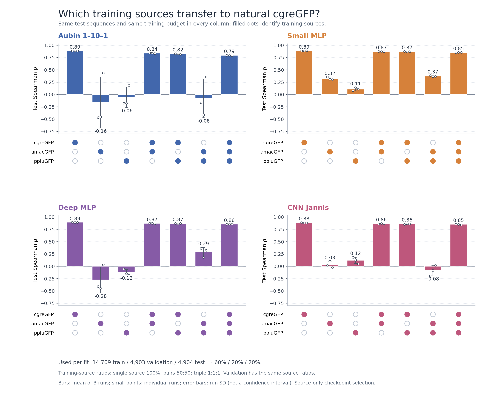
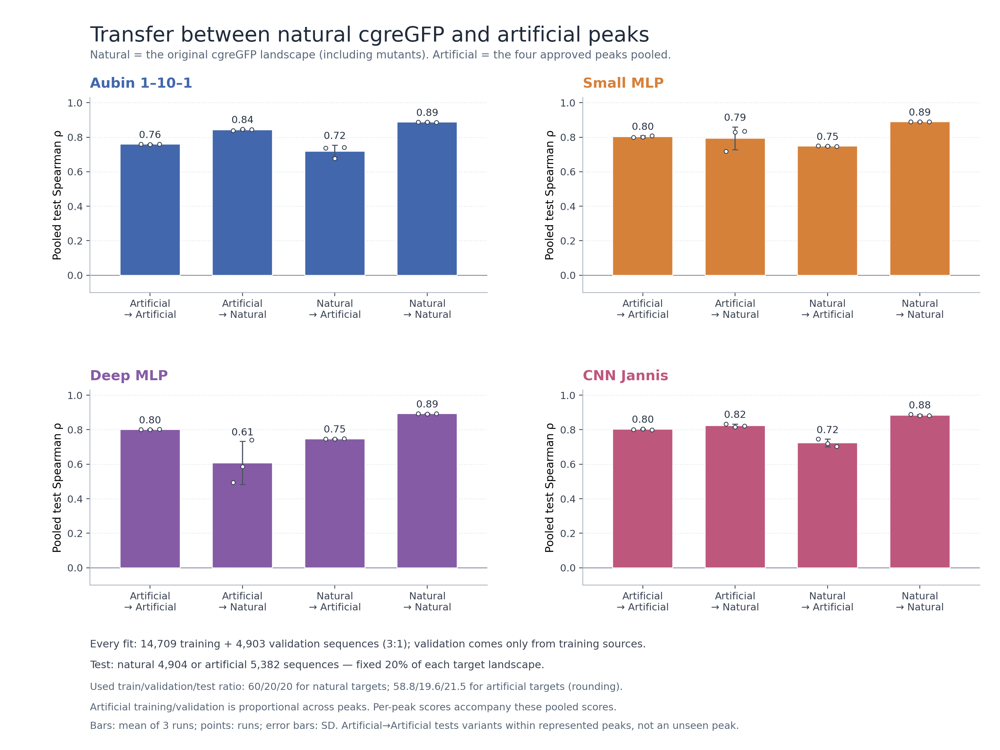

# GFP fluorescence prediction

Reproducible prediction of **log10 fluorescence from protein sequence**.
We compared one-hot baselines, mean-pooled ESM-2 regressors, and three CNNs on
full residue embeddings, then tested transfer between GFP landscapes.

## Results and figures

| Experiment | What was done | Tables | Main figures |
|---|---|---|---|
| cgreGFP benchmark | Fixed 60/20/20 holdout and 10-fold CV; 24,516 sequences; 121 ESM fits plus sequence baselines | [Report](docs/BENCHMARK_RESULTS.md) · [CSV](results/esm_cgreGFP/comparison.csv) | [CNN predictions](results/esm_cgreGFP/cv_cnn_true_vs_predicted.png) · [Mean-ESM predictions](results/esm_cgreGFP/cv_mean_true_vs_predicted.png) · [Accuracy/runtime](results/esm_cgreGFP/accuracy_vs_runtime.png) |
| Transfer | Aubin 1–10–1, small/deep MLP, CNN Jannis; seven ortholog mixtures and four natural/artificial directions; 96 fits, three seeds | [Report](results/transfer_cgreGFP_seed42_44/RESULTS.md) · [CSV](results/transfer_cgreGFP_seed42_44/summary.csv) | [Training mixtures](results/transfer_cgreGFP_seed42_44/ortholog_mixtures_spearman.png) · [Artificial peaks](results/transfer_cgreGFP_seed42_44/artificial_peak_transfer_spearman.png) |

**Main findings:** Aubin 1–10–1 is the efficient default (CV RMSE 0.234;
Spearman 0.895); deep MLP has the highest mean CV Spearman (0.899).
CNN Jannis is the strongest CNN but costs more to train. At a fixed training
budget, replacing cgre examples with amac/pplu examples reduced natural-cgre
performance. Artificial → natural ranking transferred best with Aubin
(Spearman 0.843), but absolute fluorescence calibration remained poor.
Small score differences are descriptive, not claims of statistical significance.





Transfer uses **14,709 train / 4,903 validation** records per fit, with fixed
**20% target holdouts**: 4,904 natural or 5,382 artificial sequences. Sources
contribute equally in ortholog mixtures. Error bars show SD across three seeds;
validation uses training sources only. Artificial → artificial tests within the
four represented peaks, not an unseen peak. The natural test was used in earlier
comparisons, so these transfer results are exploratory.

## Quick start

```bash
git clone https://github.com/kalininalab/gfp_project.git
cd gfp_project
conda env create -f environment.yml
conda activate gfp-benchmark
python -m unittest discover -s tests -v
python scripts/prepare_data.py
python scripts/train_aubin.py --gene cgreGFP --output results/aubin_cgreGFP_seed42
```

Run from the repository root. Create the environment and prepared data once;
the preparer refuses to overwrite existing data. The required experimental input
files are included. Training and plotting do not require the foreign repositories.
The architecture comparison against Jannis's original source is an optional test
and skips when that repository is absent.

| To reproduce… | Instructions |
|---|---|
| One-hot baselines, 10-fold splits, ESM embeddings, CNNs, tables and prediction plots | [Running models](docs/RUNNING_MODELS.md) |
| Training mixtures and natural/artificial transfer figures | [Transfer procedure and commands](docs/TRANSFER_EXPERIMENTS.md) |
| Mutation indexing, target scaling, exclusions and Aubin reference audit | [Data and baselines](docs/DATA_AND_BASELINES.md) |
| CNN architectures and fixes to the original training code | [CNN differences and bug fixes](docs/RUNNING_MODELS.md#what-are-the-three-cnns) |

The environment is pinned in [environment.yml](environment.yml). ESM uses the
frozen `facebook/esm2_t30_150M_UR50D` checkpoint; full CNN workloads need an NVIDIA
GPU. Use the documented HTCondor jobs for expensive runs. Condor wrappers contain
our cluster paths and interpreter: adjust them for another installation.

## Repository layout

- `scripts/`: preparation, models, evaluation, ESM and transfer pipelines.
- `tests/`: indexing, splits, label alignment, architecture and checkpoint checks.
- `condor/`: job wrappers, queue lists and the transfer completion workflow.
- `data/`: experimental inputs; generated `data/processed/baseline_v1/` is ignored.
- `results/`: selected reports, CSV tables and PNG/PDF/SVG figures are committed;
  generated per-fit predictions, checkpoints and logs remain local.
- `esm_embeddings/`: generated feature caches, ignored because of their size.

`master_thesis_jaca00001/` and `Orthologous_GFP_Fitness_Peaks/` are external
reference repositories and are deliberately excluded. The reusable Jannis
architecture is implemented in our model module; the original CNN script is
preserved as `CNN/model_legacy.py` for reference, not as a training entry point.
