# GFP fluorescence prediction

Reproducible prediction of **log10 fluorescence from protein sequence**.
We compared one-hot baselines, mean-pooled ESM-2 regressors, and three CNNs on
full residue embeddings, added Jannis CNN on native one-hot inputs, and tested
transfer between GFP landscapes.

## Experimental story

The experiments answer four questions in sequence. Throughout, the **target
test set is frozen**, is shared by all compared methods, and is never available
for training or acquisition.

> **ALL TARGET-ADAPTATION DIAGNOSTICS:**
> **[OPEN THE COMPLETE SCENARIO-BY-SCENARIO ATLAS](results/target_adaptation_diagnostic_atlas/README.md)**
> · **[ALL 56 TRUE/PREDICTED DISTRIBUTION PANELS](results/target_adaptation_diagnostic_atlas/distributions/)**
> · **[ALL 56 TRUE-VS-PREDICTED DOTPLOT PANELS](results/target_adaptation_diagnostic_atlas/dotplots/)**
>
> The atlas covers **all 8 transfer directions, all 7 main training/acquisition
> scenarios, all 4 models and all 5 seeds**. Filenames state the source, target,
> selection method, round and number of target sequences added.

> **[COMPLETE TARGET-ADAPTATION REPORT: R² AND ALL OTHER METRICS, BAR PLOTS,
> DISTRIBUTIONS AND DOTPLOTS](results/target_adaptation_complete_report/README.md)**

| Stage | What enters training after the initial fit? | Target sequences added? |
|---|---|---|
| Transfer without AL | Nothing | **No** |
| Source-pool AL transfer | Sequences selected from the original **source-protein training pool** | **No** |
| Target adaptation | Sequences selected from a separate labelled pool of the **target protein/domain** | **Yes: 96 per round for 10 rounds** |
| One-shot target-adaptation control | 960 target-pool sequences added once | **Yes: 960 once, no AL rounds** |

### 1. Establish the base models without active learning

We first compare Aubin, Linear, MLP and CNN on OHE without iterative
acquisition. These fits establish predictive accuracy on natural cgreGFP and
the initial transferability between proteins and between natural cgreGFP and
artificial peaks.

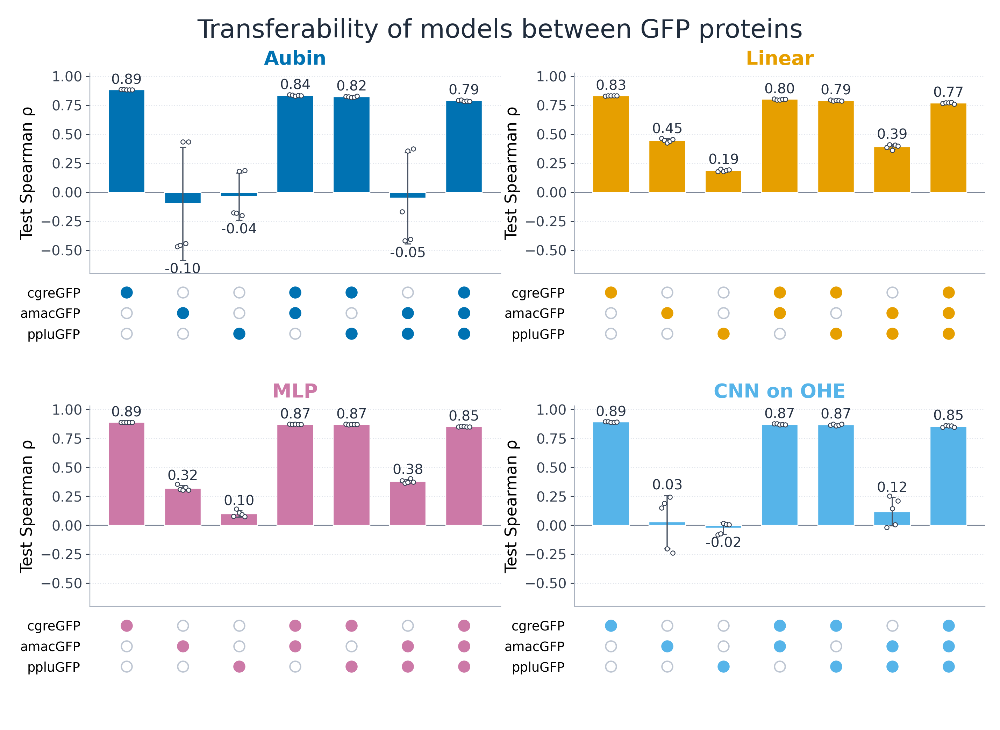

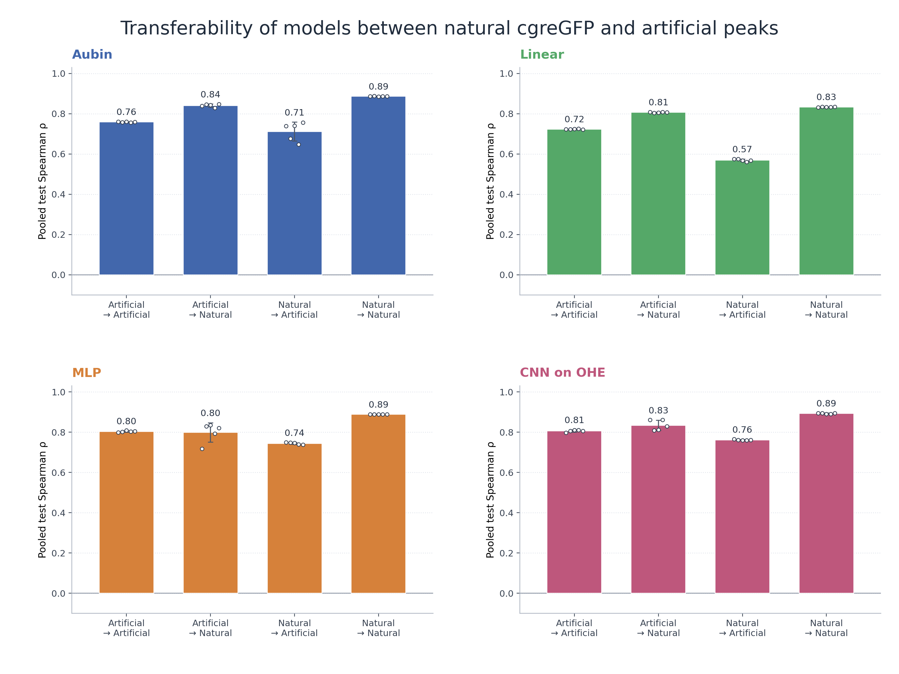

### 2. Ask whether active selection improves source-only transfer

Here AL selects additional records from the **source training pool**. It does
**not add any sequence from the target protein or target domain**. Each
trajectory starts at 10% of the 14,709-record source budget and reaches 14,709
source records over ten rounds. The target test remains untouched.

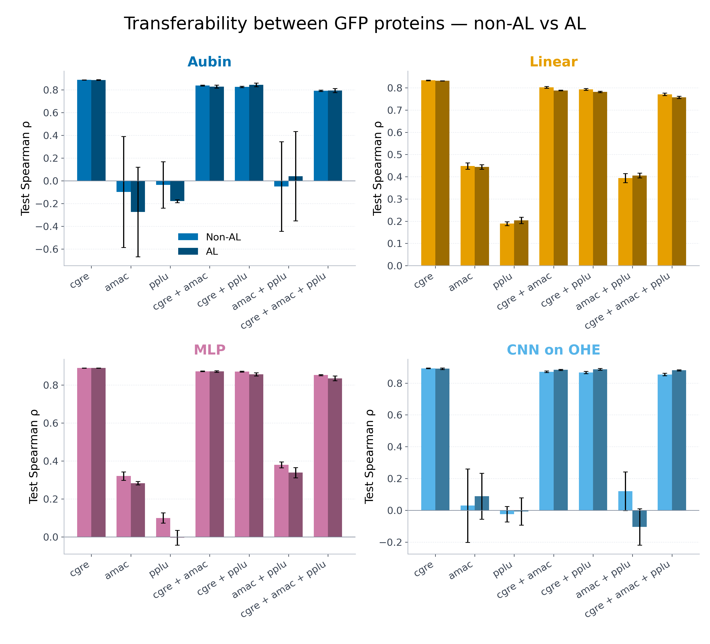

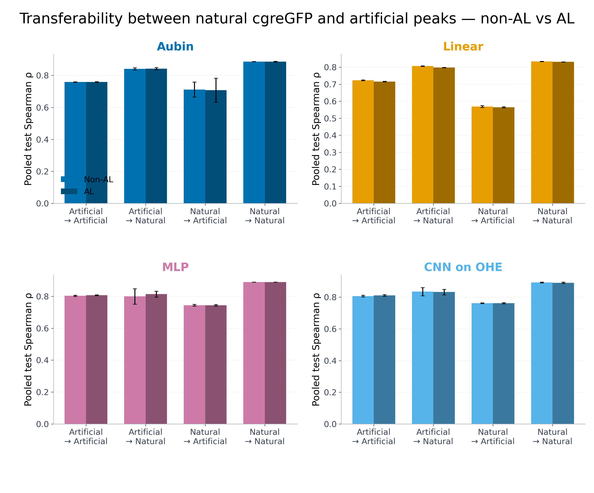

### 3. Test the acquisition rule and its uncertainty term

Random and Fancy arms use identical initial source records, round budgets and
frozen tests. Fancy ranks the source pool by
`0.62 × scaled distance + 0.38 × scaled uncertainty`. For Aubin and Linear,
uncertainty is variance across a five-member bootstrap ensemble; for MLP it is
variance across five independently initialized fits. All **120/120**
ensemble-uncertainty trajectories are complete. This experiment still adds
**zero target sequences**.

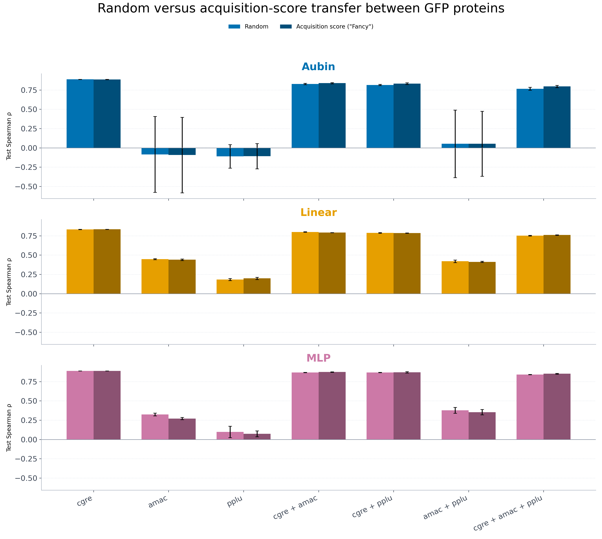

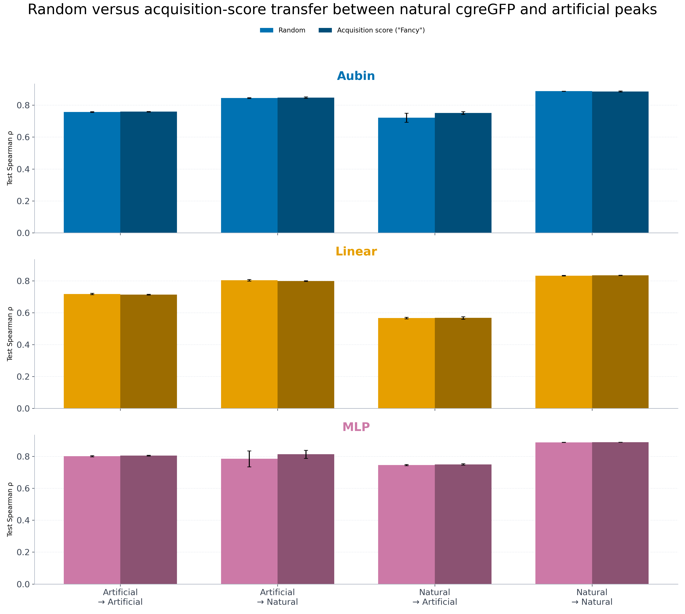

### 4. Add target sequences: target adaptation

This is the experiment in which target data actually enter training. Starting
from a source-trained model, the iterative arms add **96 selected target-pool
sequences after every round for 10 rounds**, for a total of 960. The matched
one-shot controls add **960 target-pool sequences once** and have no acquisition
rounds. Random and Fancy use the same initial fit, total target-label budget,
validation records and frozen target test.

All four models are shown together below. Aubin, Linear and MLP are complete.
CNN protein-to-protein adaptation is also complete; every row uses all five
seeds.

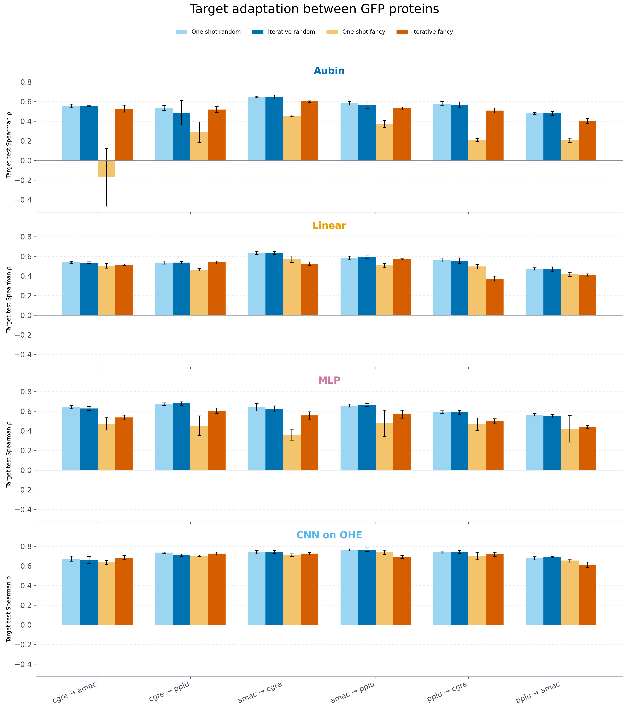

All four models are complete for natural cgreGFP ↔ artificial peaks:

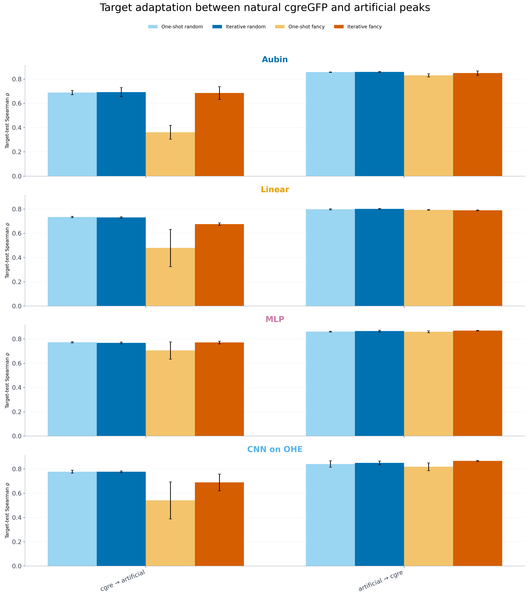

The density panels below show the same `cgreGFP → amacGFP` iterative-Fancy
trajectory after adding the first 96 target sequences and after all ten rounds
(960 target sequences). Curves use the frozen amacGFP test; predicted densities
pool five model seeds, while the true test density is shown once.

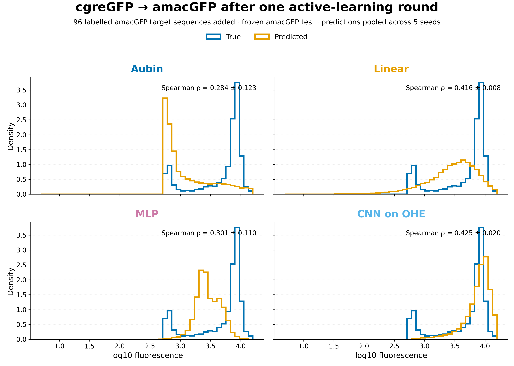

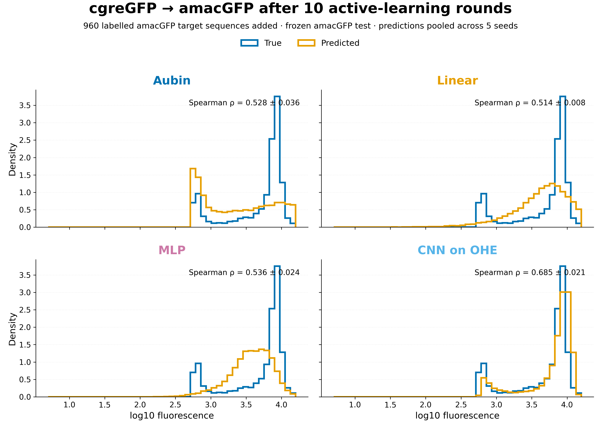

For the matched non-AL control, 960 target sequences are sampled randomly and
added in a single fit. There is no Fancy score and there are no iterative
refitting/acquisition rounds:

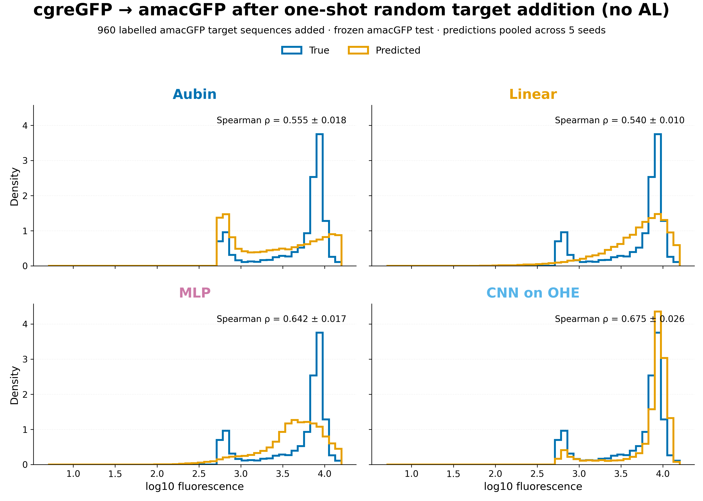

The same one-shot random control for transfer between natural cgreGFP and its
artificial peaks:

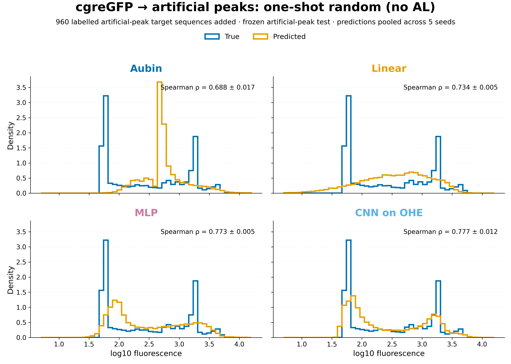

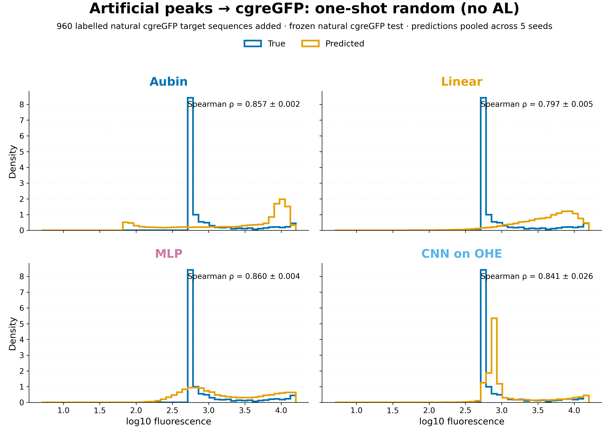

The complete diagnostic atlas contains every direction and all seven main
conditions, with densities and dotplots in separate folders:

- [Browse all 56 distribution panels](results/target_adaptation_diagnostic_atlas/distributions/)
- [Browse all 56 true-vs-predicted dotplot panels](results/target_adaptation_diagnostic_atlas/dotplots/)
- [Scenario-by-scenario index](results/target_adaptation_diagnostic_atlas/README.md)

## Complete result index

| Experiment | What was done | Tables | Main figures |
|---|---|---|---|
| cgreGFP benchmark | Fixed 60/20/20 holdout and 10-fold CV; 24,516 sequences; 121 ESM fits + 11 Jannis OHE fits + sequence baselines | [Report](docs/BENCHMARK_RESULTS.md) · [CSV](results/esm_cgreGFP/comparison.csv) | [CNN predictions](results/esm_cgreGFP/cv_cnn_true_vs_predicted.png) · [Mean-ESM predictions](results/esm_cgreGFP/cv_mean_true_vs_predicted.png) · [Accuracy/runtime](results/esm_cgreGFP/accuracy_vs_runtime.png) |
| Transfer before AL | Aubin, Linear, MLP and CNN on OHE; seven ortholog mixtures and four natural/artificial directions; 5 seeds | [Report](results/transfer_cgreGFP_seed42_46/RESULTS.md) · [CSV](results/transfer_cgreGFP_seed42_46/summary.csv) | [GFP proteins](results/transfer_cgreGFP_seed42_46/ortholog_mixtures_spearman.png) · [Artificial peaks](results/transfer_cgreGFP_seed42_46/artificial_peak_transfer_spearman.png) |
| Transfer with AL | Same models, seeds, budgets and frozen tests; 10 acquisition rounds; 160/160 trajectories | [Results](results/transfer_al_cgreGFP_seed42_46/RESULTS.md) · [CSV](results/transfer_al_cgreGFP_seed42_46/summary.csv) · [Protocol](docs/TRANSFER_ACTIVE_LEARNING.md) | [GFP proteins](results/transfer_al_cgreGFP_seed42_46/ortholog_mixtures_spearman.png) · [Non-AL vs AL](results/transfer_al_cgreGFP_seed42_46/ortholog_mixtures_spearman_non_al_vs_al.png) · [Artificial peaks](results/transfer_al_cgreGFP_seed42_46/artificial_peak_transfer_spearman.png) |
| Random vs acquisition score ("Fancy") transfer | CNN on OHE; matched initial sets, budgets, seeds and frozen tests | [Live status and exact method](results/transfer_random_cgreGFP_seed42_46/STATUS.md) · [Frozen protocol](results/transfer_random_cgreGFP_seed42_46/protocol.json) | [GFP proteins — available after completion](results/transfer_random_cgreGFP_seed42_46/sampling_ortholog_transfer.png) · [Natural/artificial peaks — available after completion](results/transfer_random_cgreGFP_seed42_46/sampling_peak_transfer.png) |
| Random vs acquisition score transfer — Linear | 40 acquisition-score and 40 matched random CPU trajectories; 5 seeds | [Status](results/transfer_random_linear_cgreGFP_seed42_46/STATUS.md) · [Frozen protocol](results/transfer_random_linear_cgreGFP_seed42_46/protocol.json) | [GFP proteins](results/transfer_random_linear_cgreGFP_seed42_46/sampling_ortholog_transfer.png) · [Natural/artificial peaks](results/transfer_random_linear_cgreGFP_seed42_46/sampling_peak_transfer.png) |
| Ensemble uncertainty for non-CNN models | Aubin, Linear and MLP; 5-member ensembles; matched Random/Fancy comparison; 120/120 trajectories | [Results and method](results/transfer_ensemble_sampling_cpu_seed42_46/RESULTS.md) · [Protocol](results/transfer_al_ensemble_cpu_seed42_46/protocol.json) | [GFP proteins](results/transfer_ensemble_sampling_cpu_seed42_46/sampling_ortholog_transfer_cpu_models.png) · [Natural/artificial peaks](results/transfer_ensemble_sampling_cpu_seed42_46/sampling_peak_transfer_cpu_models.png) |
| Target-protein adaptation | 96 target sequences × 10 or 960 once; fancy/random; 6 directed protein pairs; 3 CPU models; 5 seeds; 90/90 jobs | [Results](results/target_adaptation_seed42_46/RESULTS.md) · [CSV](results/target_adaptation_seed42_46/summary.csv) · [Design](docs/TARGET_ADAPTATION.md) | [Four-arm comparison](results/target_adaptation_seed42_46/target_adaptation_comparison.png) |
| Natural cgreGFP/artificial-peak adaptation | Same 96 × 10 versus 960-once design in both directions; 3 CPU models; 5 seeds; 30/30 jobs | [Results](results/target_adaptation_peaks_seed42_46/RESULTS.md) · [CSV](results/target_adaptation_peaks_seed42_46/summary.csv) · [Design](docs/TARGET_ADAPTATION.md) | [Four-arm comparison](results/target_adaptation_peaks_seed42_46/target_adaptation_comparison.png) |
| CNN target-protein adaptation | CNN on OHE; 96 × 10 versus 960 once; fancy/random; 6 directed protein pairs; 5 seeds; 30/30 complete | [Results](results/target_adaptation_cnn_seed42_46/RESULTS.md) · [CSV](results/target_adaptation_cnn_seed42_46/summary.csv) | [Four-arm comparison](results/target_adaptation_cnn_seed42_46/target_adaptation_comparison.png) |
| CNN natural/artificial adaptation | CNN on OHE; same four arms in both directions; 5 seeds; 10/10 complete | [Results](results/target_adaptation_peaks_cnn_seed42_46/RESULTS.md) · [CSV](results/target_adaptation_peaks_cnn_seed42_46/summary.csv) | [Four-arm comparison](results/target_adaptation_peaks_cnn_seed42_46/target_adaptation_comparison.png) |

<details>
<summary>Detailed result notes and archived intermediate figures</summary>

[Selected models: cgre → cgre scatter panel](results/transfer_cgreGFP_seed42_44/cgre_true_vs_predicted/cgre_test_all_seeds.png)
shows individual saved predictions from all three cgre-only control fits.
[PDF](results/transfer_cgreGFP_seed42_44/cgre_true_vs_predicted/cgre_test_seed42.pdf) ·
[All seeds and formats](results/transfer_cgreGFP_seed42_44/cgre_true_vs_predicted/) ·
[Metrics](results/transfer_cgreGFP_seed42_44/cgre_true_vs_predicted/metrics.csv).

[amacGFP + ppluGFP → cgreGFP scatter panel](results/transfer_cgreGFP_seed42_44/amac_pplu_to_cgre_true_vs_predicted/amac_pplu_to_cgre_all_seeds.png)
shows the four selected models across all three seeds on the same 4,904 held-out
cgreGFP sequences ([metrics](results/transfer_cgreGFP_seed42_44/amac_pplu_to_cgre_true_vs_predicted/metrics.csv)).

**Best measured accuracy: Jannis CNN on OHE** (CV RMSE 0.227, R² 0.912,
Spearman 0.900). **Efficient default: Aubin 1–10–1 on OHE** (RMSE 0.234,
R² 0.908): its holdout fit takes 65 seconds on CPU versus 20.7 minutes on GPU
for Jannis OHE. Deep MLP has nearly the same ranking score (0.899) at lower cost.
Small differences are descriptive, not claims of statistical significance.

The transfer experiment compares Aubin, Linear, MLP and CNN on OHE over five
seeds. All models use aligned one-hot inputs and identical source budgets.


Transfer uses **14,709 train / 4,903 validation** records per fit, with fixed
**20% target holdouts**: 4,904 natural or 5,382 artificial sequences. Sources
contribute equally in ortholog mixtures. Error bars show SD across five seeds;
validation uses training sources only. Artificial → artificial tests within the
four represented peaks, not an unseen peak. The natural test was used in earlier
comparisons, so these transfer results are exploratory.

### Active-learning transfer

All **160 five-seed trajectories** for Aubin, Linear, MLP and CNN on OHE are
complete. Each trajectory has an initial fit plus ten acquisition rounds and ends
at the same 14,709-label budget as the non-AL transfer benchmark. AL and non-AL
use the exact same frozen test records. Bars show the mean and error bars show
sample SD across seeds 42–46.

**Matched model selection without and with AL on frozen natural cgreGFP test:**

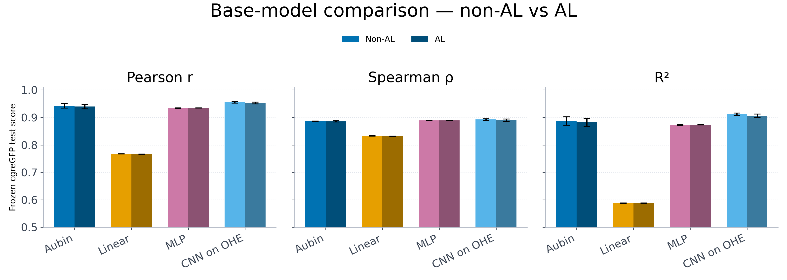

**Transfer between GFP proteins after AL:**

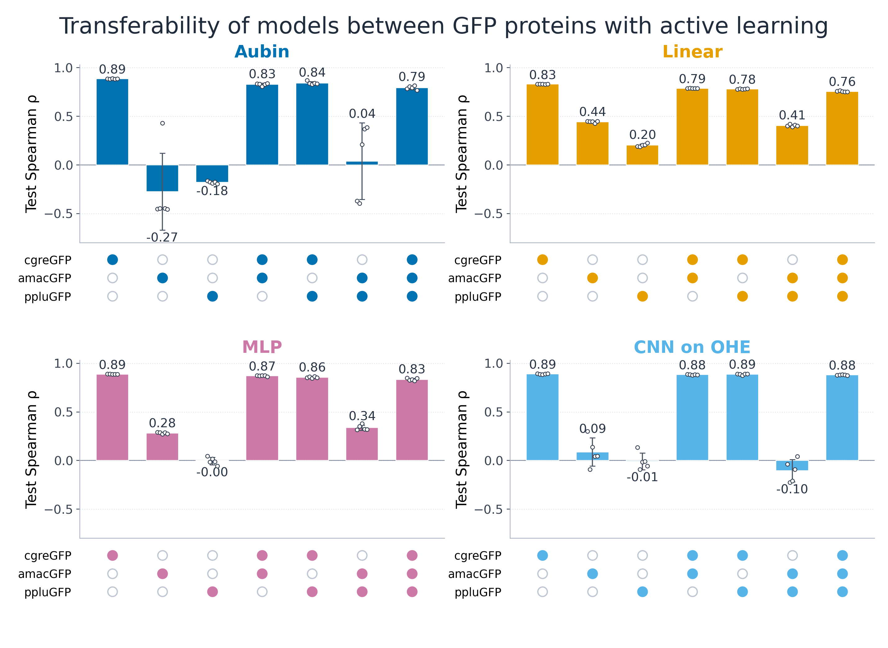

**Matched non-AL and AL transfer between GFP proteins:**


**Transfer between natural cgreGFP and artificial peaks after AL:**

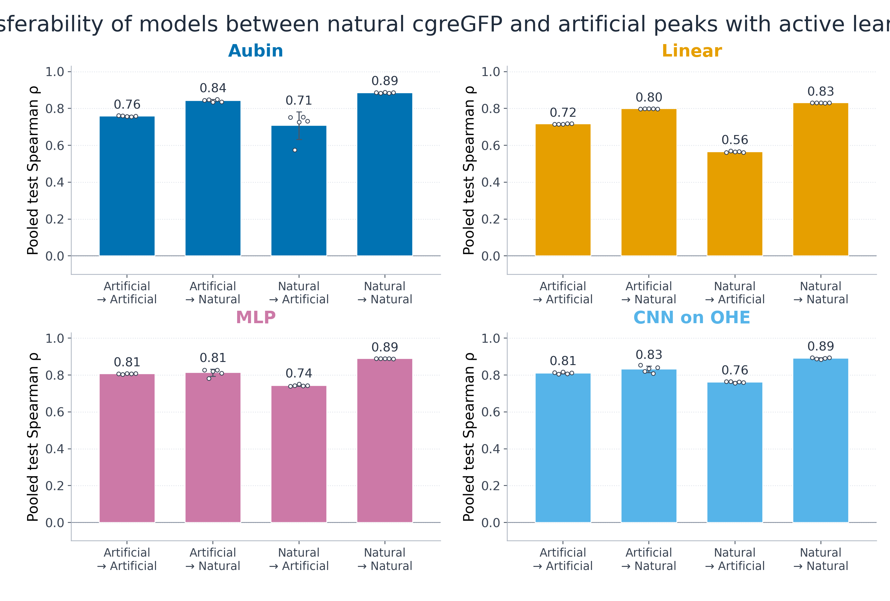

**Matched non-AL and AL transfer between natural cgreGFP and artificial peaks:**


### Target-protein adaptation

The next experiment adds 96 labelled target sequences over ten iterative rounds
or adds 960 sequences once. It compares random and acquisition-score selection
for all six directed natural-protein pairs and both natural/artificial directions.

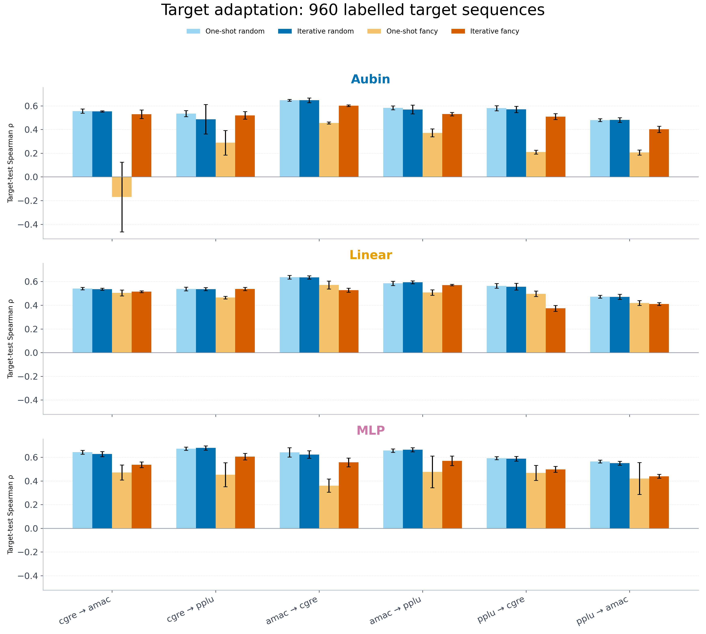

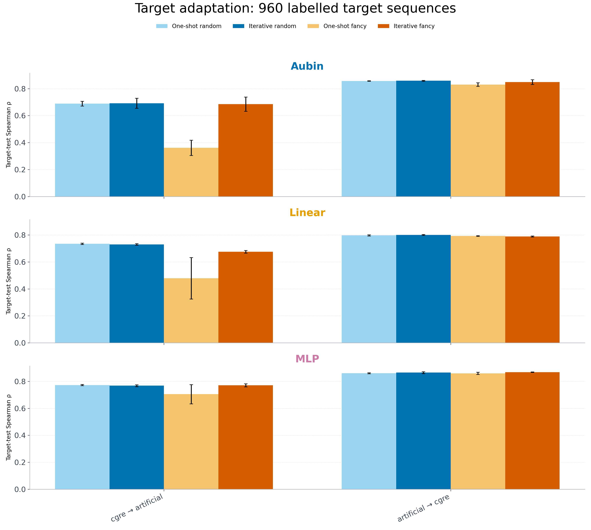

### Random versus acquisition score ("Fancy") transfer

This is a separate five-seed CNN-on-OHE experiment for both GFP-protein transfer
and natural cgreGFP/artificial-peak transfer. Random and acquisition-score arms
share the initial labelled records, label budgets, validation sets and frozen
tests. [Current status and exact method](results/transfer_random_cgreGFP_seed42_46/STATUS.md).

The acquisition arm uses `0.62 × scaled hidden-space distance + 0.38 × scaled
MC-dropout variance`, followed by global descending-score selection. It does not
run the student's dense SpectralClustering/3-mer stage, whose pool affinity
matrix is quadratic at this scale. The labels and documentation state this
explicitly.

The following links will resolve to the final figures immediately after all 40
random trajectories finish and the finalizer validates both arms:

- [Random vs acquisition score between GFP proteins](results/transfer_random_cgreGFP_seed42_46/sampling_ortholog_transfer.png)
- [Random vs acquisition score between natural cgreGFP and artificial peaks](results/transfer_random_cgreGFP_seed42_46/sampling_peak_transfer.png)

### Random versus acquisition score transfer — CPU models

This five-seed CPU experiment repeats the same comparison for **Aubin, Linear
and MLP** for GFP-protein transfer and natural cgreGFP/artificial-peak transfer.
The acquisition-score and matched random trajectories are complete for all
three models. Every arm shares initial labelled records, label budgets,
validation sets and frozen tests.

Aubin, Linear and MLP contain no dropout, so their uncertainty term is zero.
Their acquisition score is therefore the scaled distance from the labelled
training set in each model's projected hidden representation. As in the CNN
experiment, selection uses global descending scores and does not run the dense
SpectralClustering/3-mer stage.

We retain those completed distance-only trajectories as the reproducible first
version. A versioned five-member ensemble experiment recalculates the
three CPU models with uncertainty included. Aubin and Linear use bootstrap
ensembles; MLP uses independent initializations. In each case the pool score is
`0.62 × scaled distance + 0.38 × scaled ensemble prediction variance`, while
the primary model alone evaluates the unchanged frozen test. See the
[exact method and reproduction commands](docs/TRANSFER_ACTIVE_LEARNING.md#ensemble-uncertainty-extension-for-cpu-models).

Final ensemble-uncertainty comparisons:


The earlier Linear-only figures remain available for provenance:

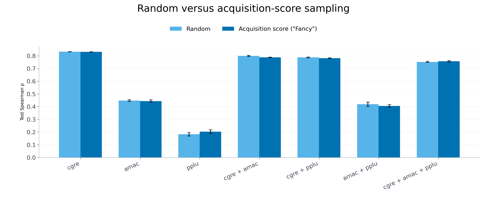

**Random versus acquisition-score sampling between natural cgreGFP and artificial peaks:**

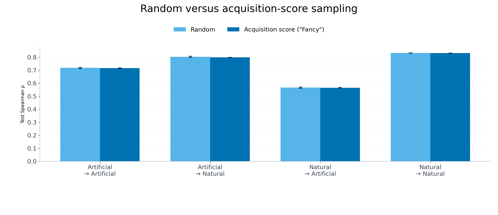

Distance-only three-model figure paths:

- [Aubin, Linear and MLP between GFP proteins](results/transfer_random_cpu_models_cgreGFP_seed42_46/sampling_ortholog_transfer_cpu_models.png)
- [Aubin, Linear and MLP between natural cgreGFP and artificial peaks](results/transfer_random_cpu_models_cgreGFP_seed42_46/sampling_peak_transfer_cpu_models.png)

R² is reported in the result tables alongside correlations: 1 is perfect, 0
matches the test-mean predictor, and negative values indicate worse squared error.

</details>

## Quick start

**Experiment 1 — base-model comparison without active learning:** the supplied draft describes a random 80/20 cgre
split but omits several parameters and its promised appendix. The
[reproduction audit and exact commands](docs/PAPER_REPRODUCTION.md) distinguish
published facts, legacy-code assumptions, the existing ten-fold validation and
the new five-model 80/20 comparison. Do not present the 1%-initial-label AL pilot
as reproduction of the manuscript's fully supervised Pearson 0.943 result.
[Results](results/paper_reproduction_cgre_80_20/RESULTS.md) ·
[CSV](results/paper_reproduction_cgre_80_20/summary.csv) ·
[Figure](results/paper_reproduction_cgre_80_20/model_comparison.png).

The initial seed-42 result is retained as an important no-AL baseline; seeds
42–46 quantify its variation.

**Experiment 2 — acquisition versus random sampling:** matched seeds compare
the manuscript acquisition score with nested random subsets at equal label
budgets. Both use fixed 20% tests and report R², Pearson, Spearman and Kendall
tau. See the
[protocol and reproduction commands](docs/JANNIS_EXPERIMENTS.md).
[Results](results/experiment_2_sampling/RESULTS.md) ·
[CSV](results/experiment_2_sampling/summary.csv) ·
[Figure](results/experiment_2_sampling/sampling_comparison.png).

```bash
git clone https://github.com/kalininalab/gfp_project.git
cd gfp_project
conda env create -f environment.yml
conda activate gfp-benchmark
python -m unittest discover -s tests -v
python scripts/prepare_data.py
python scripts/train_aubin.py --gene cgreGFP --output results/aubin_cgreGFP_seed42
```

Run from the repository root. Create the environment and prepared data once;
the preparer refuses to overwrite existing data. The required experimental input
files are included. Training and plotting do not require the foreign repositories.
The architecture comparison against Jannis's original source is an optional test
and skips when that repository is absent.

| To reproduce… | Instructions |
|---|---|
| One-hot baselines, 10-fold splits, ESM embeddings, CNNs, tables and prediction plots | [Running models](docs/RUNNING_MODELS.md) |
| Training mixtures and natural/artificial transfer figures | [Transfer procedure and commands](docs/TRANSFER_EXPERIMENTS.md) |
| Transfer with active learning, round diagnostics and paired figures | [Transfer active-learning protocol](docs/TRANSFER_ACTIVE_LEARNING.md) |
| Iterative and one-shot target-protein adaptation | [Target-adaptation protocol](docs/TARGET_ADAPTATION.md) |
| Mutation indexing, target scaling, exclusions and Aubin reference audit | [Data and baselines](docs/DATA_AND_BASELINES.md) |
| CNN architectures and fixes to the original training code | [CNN differences and bug fixes](docs/RUNNING_MODELS.md#what-are-the-three-cnns) |

The environment is pinned in [environment.yml](environment.yml). ESM uses the
frozen `facebook/esm2_t30_150M_UR50D` checkpoint; full CNN workloads need an NVIDIA
GPU. Use the documented HTCondor jobs for expensive runs. Condor wrappers contain
our cluster paths and interpreter: adjust them for another installation.

## Repository layout

- `scripts/`: preparation, models, evaluation, ESM and transfer pipelines.
- `tests/`: indexing, splits, label alignment, architecture and checkpoint checks.
- `condor/`: job wrappers, queue lists and the transfer completion workflow.
- `data/`: experimental inputs; generated `data/processed/baseline_v1/` is ignored.
- `results/`: selected reports, CSV tables and PNG/PDF/SVG figures are committed;
  generated per-fit predictions, checkpoints and logs remain local.
- `esm_embeddings/`: generated feature caches, ignored because of their size.

On this installation, ignored large artifacts belong under
`/data/users/akolchina/gfp_project_artifacts`; compatibility symlinks may keep
the paths above usable. They are never repository inputs.

`master_thesis_jaca00001/` and `Orthologous_GFP_Fitness_Peaks/` are external
reference repositories and are deliberately excluded. The reusable Jannis
architecture is implemented in our model module; the original CNN script is
preserved as `CNN/model_legacy.py` for reference, not as a training entry point.
