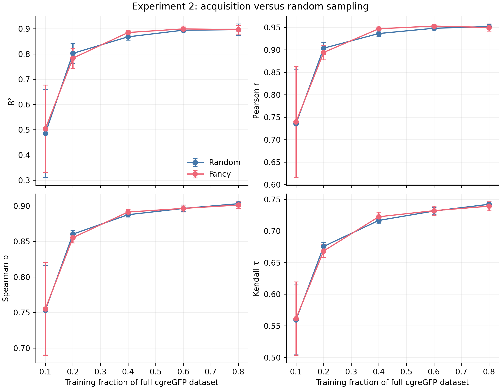

# Experiment 2: acquisition versus random sampling

Five matched seeds (42–46). Within each seed, fancy and random sampling use the
same fixed 20% cgreGFP test set, initial 10% training set, target label budgets,
architecture and fitting protocol. Error bars are sample SD across seeds.

The former training-size calculation is retained only as the random-sampling
control for this comparison; it is not presented as a separate experiment.

[Raw metrics](summary.csv) · [PDF](sampling_comparison.pdf) · [SVG](sampling_comparison.svg)
