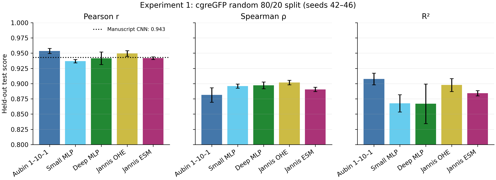

# Experiment 1: base-model comparison without active learning

Random 80/20 cgreGFP split; seeds 42–46; 50 Adam epochs. Values are mean ± sample SD.

| Model | Pearson | Spearman | Kendall τ | R² | RMSE |
|---|---:|---:|---:|---:|---:|
| Aubin 1–10–1 | 0.954 ± 0.004 | 0.881 ± 0.012 | 0.709 ± 0.022 | 0.908 ± 0.010 | 0.234 ± 0.012 |
| Small MLP | 0.937 ± 0.003 | 0.896 ± 0.003 | 0.736 ± 0.004 | 0.868 ± 0.014 | 0.280 ± 0.014 |
| Deep MLP | 0.942 ± 0.010 | 0.897 ± 0.006 | 0.742 ± 0.009 | 0.867 ± 0.032 | 0.279 ± 0.035 |
| Jannis OHE | 0.949 ± 0.005 | 0.902 ± 0.004 | 0.741 ± 0.005 | 0.898 ± 0.011 | 0.246 ± 0.012 |
| Jannis ESM | 0.942 ± 0.002 | 0.891 ± 0.004 | 0.722 ± 0.005 | 0.884 ± 0.004 | 0.262 ± 0.005 |

The held-out test is never used for fitting, checkpoint selection, or model selection.

