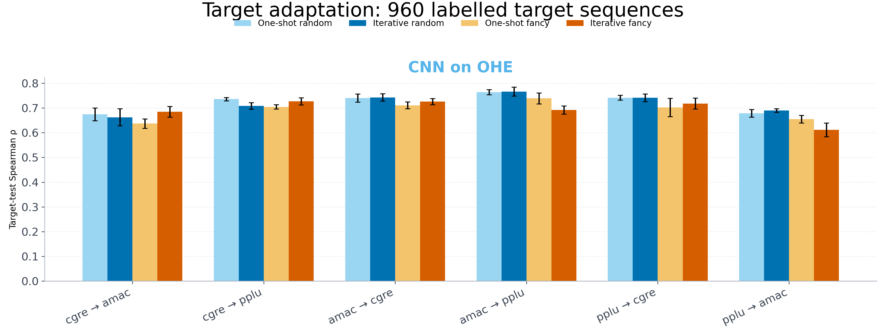

# Target-protein adaptation

Five seeds and 1 model(s). Iterative arms acquire 96 target sequences in each of ten rounds; one-shot arms add 960 target sequences once. All arms share the same frozen target test.

