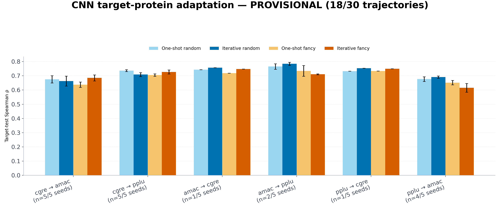

# CNN target-protein adaptation — provisional

**18/30 trajectories are complete. This is not the final result.** Each x-axis label reports the number of completed seeds used for that pair. Missing pairs are intentionally blank. The finalizer will replace this with the preregistered five-seed figure after all jobs finish.

