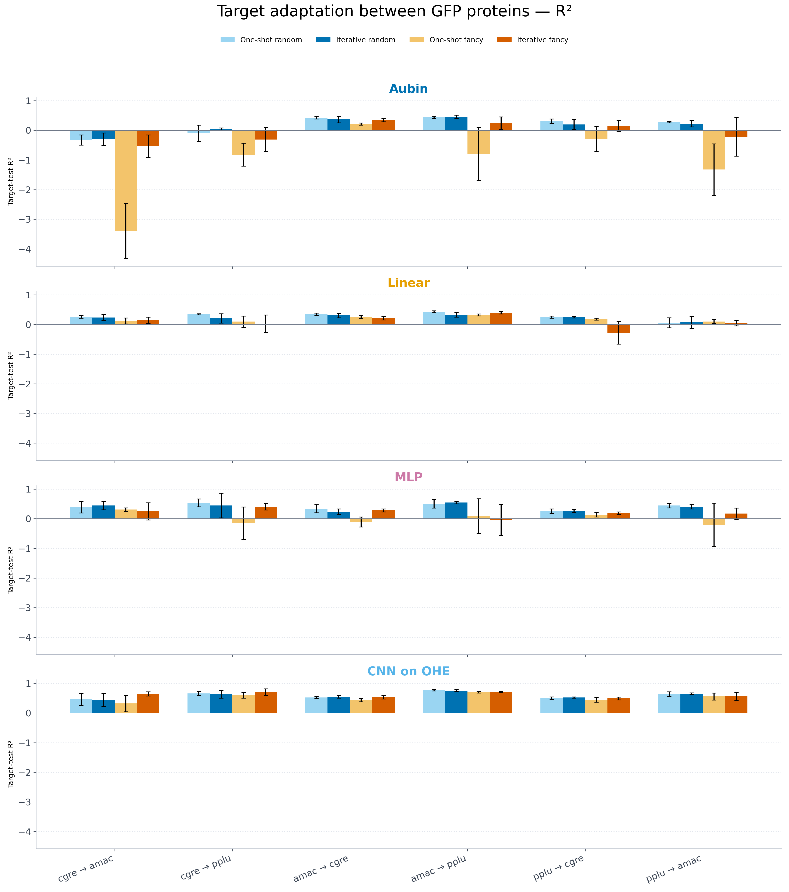
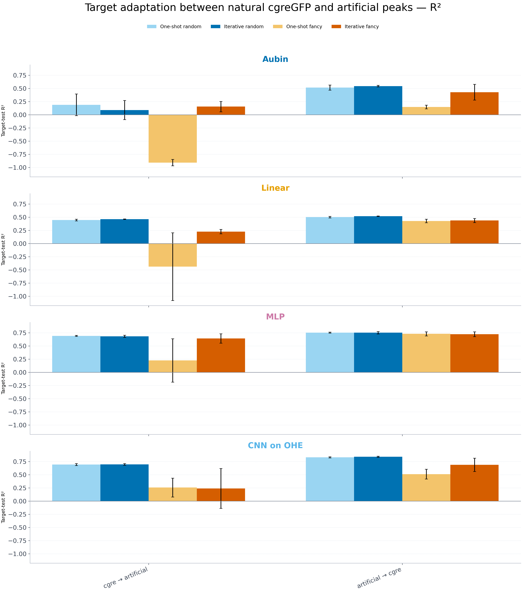
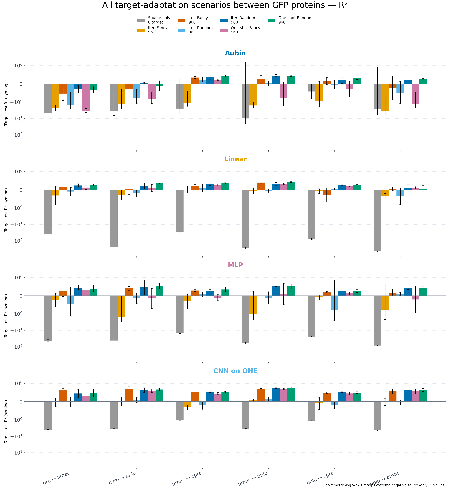
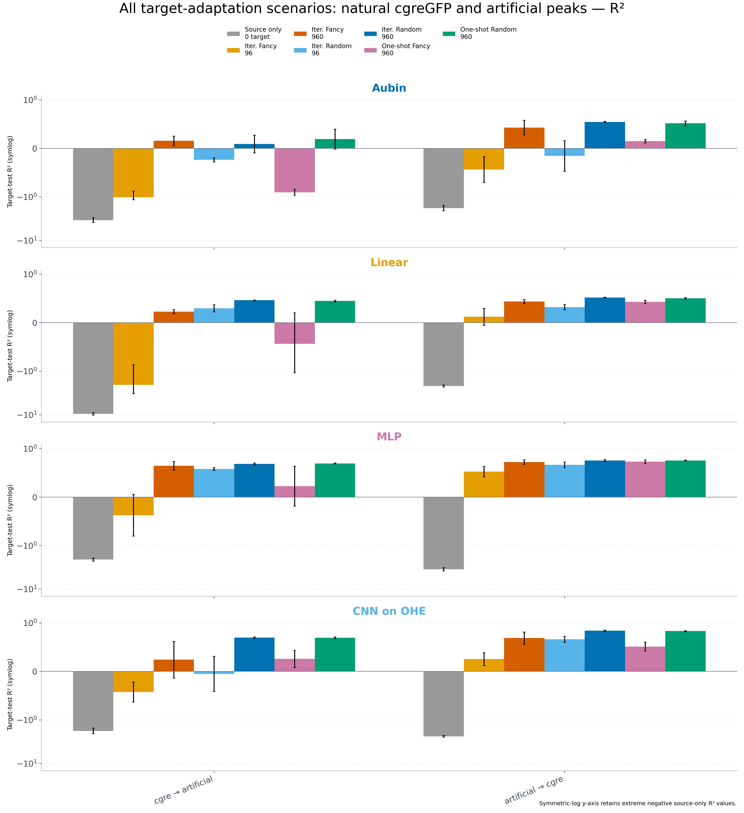
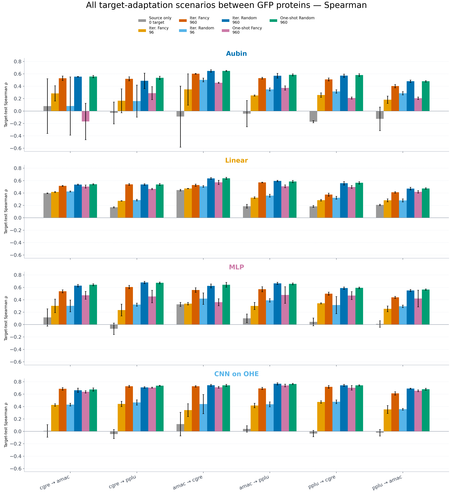
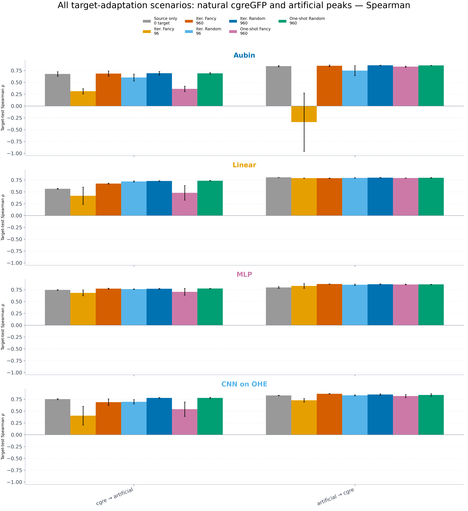

# Complete target-adaptation results

This is the canonical entry point for the target-adaptation experiments. It links the complete metric tables and figures without duplicating the underlying predictions or per-round artifacts.

## What is covered

- 8 directed transfer scenarios: 6 between natural GFP proteins and 2 between natural cgreGFP and artificial peaks;
- Aubin, Linear, MLP and CNN on OHE;
- seeds 42–46 and one shared frozen target test per direction;
- source-only, iterative Fancy, iterative Random, one-shot Fancy and one-shot Random;
- iterative metrics for every round from 96 through 960 added target sequences;
- MSE, RMSE, R², Pearson, Spearman and Kendall tau.

## Metric tables

- [Every per-seed result](metrics_per_seed.csv): one row per direction, model, seed, arm and evaluated round.
- [Mean and sample SD across five seeds](metrics_summary.csv): includes every metric, especially `r2_mean` and `r2_sd`.
- [Figure index](figure_index.csv): machine-readable paths matching every distribution with its dotplot.

## Final-budget bar plots

These compare the four 960-target-sequence arms: one-shot Random, iterative Random, one-shot Fancy and iterative Fancy.

### Spearman

- [All four models between GFP proteins](../target_adaptation_combined_seed42_46/target_adaptation_all_models.png)
- [All four models between natural cgreGFP and artificial peaks](../target_adaptation_combined_seed42_46/target_adaptation_peaks_all_models.png)

### R²

## All scenarios, including no AL and 96 target sequences

These figures include source-only models with zero target sequences, both
iterative methods after the first 96-sequence round and after all ten rounds,
and both one-shot 960-sequence controls.

### R² — all scenarios

### Spearman — all scenarios

## Prediction diagnostics

- [All 56 true/predicted distribution panels](../target_adaptation_diagnostic_atlas/distributions/)
- [All 56 true-vs-predicted dotplot panels](../target_adaptation_diagnostic_atlas/dotplots/)
- [Human-readable scenario index](../target_adaptation_diagnostic_atlas/README.md)

Large raw predictions, model checkpoints and per-round diagnostics remain under the experiment `fits/` directories, linked to `/data/users/akolchina/gfp_project_artifacts`.
